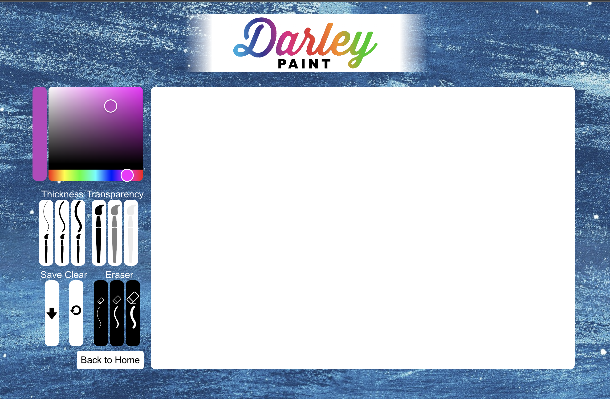

# Darley Paint

https://darleyinfo.vercel.app/

Author: Darya Leylian

Github: https://github.com/dsleylian
<br />

## How to Use

Darley Paint is an app based on the classic Microsoft Paint. You can pick a brush thickness, transparency, and color, and paint what you'd like on the canvas. You have 3 eraser thicknesses to choose from if you need to fix something, as well as a reset button to start with a fresh canvas.


## Development:

This web app was made using:
- React
- Javascript
- HTML
- CSS

##Install Instructions

first install all dependencies with
```
npm install
````
Then, to run locally:
```
npm start
```

## Mintbean Hackathon

This app was build for the Mintbean Hackathon. Here is the propmt: 

Build an app that lets people express their creativity in a visual format. You can build ANY application you'd like. Whether it's a blank canvas that you can paint on, a photo-editing app, a shared white board -- as long as it fulfills one OR both of the following requirements:

- As a user, I can drag my mouse across the screen to make free-form lines.
- As a user, I can click areas of the screen with my mouse to fill them with a color, texture or pattern.